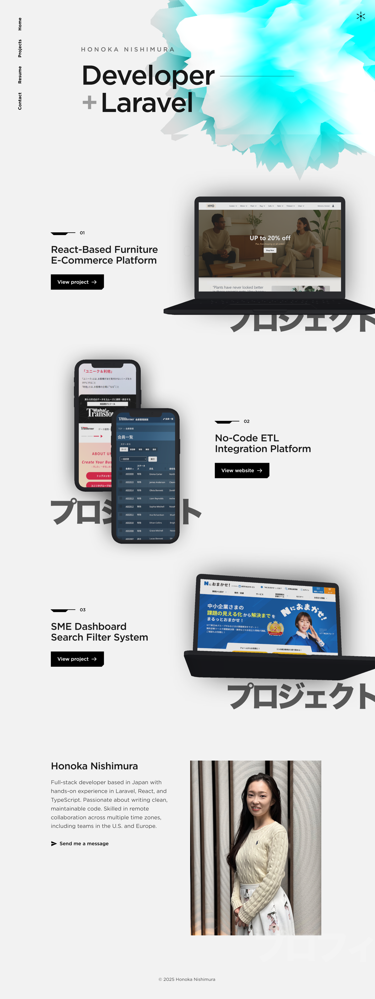
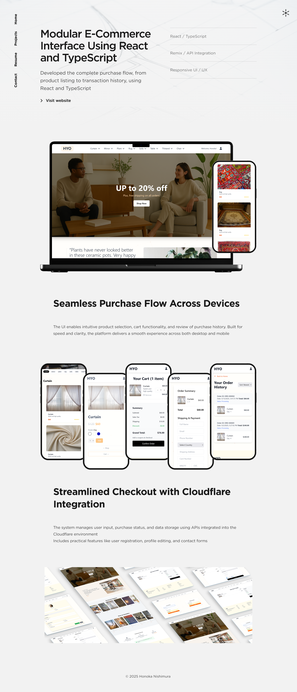
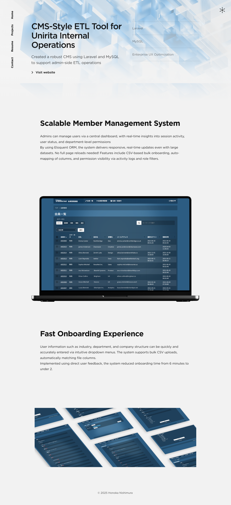
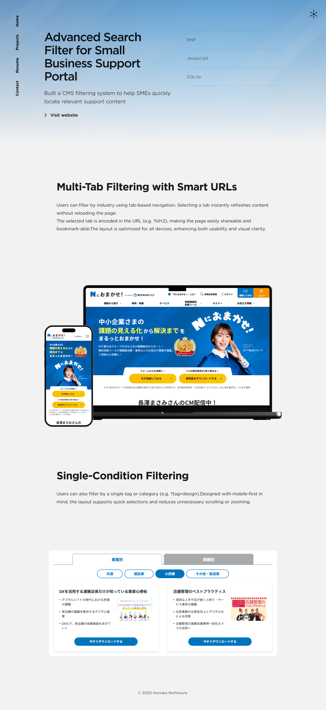
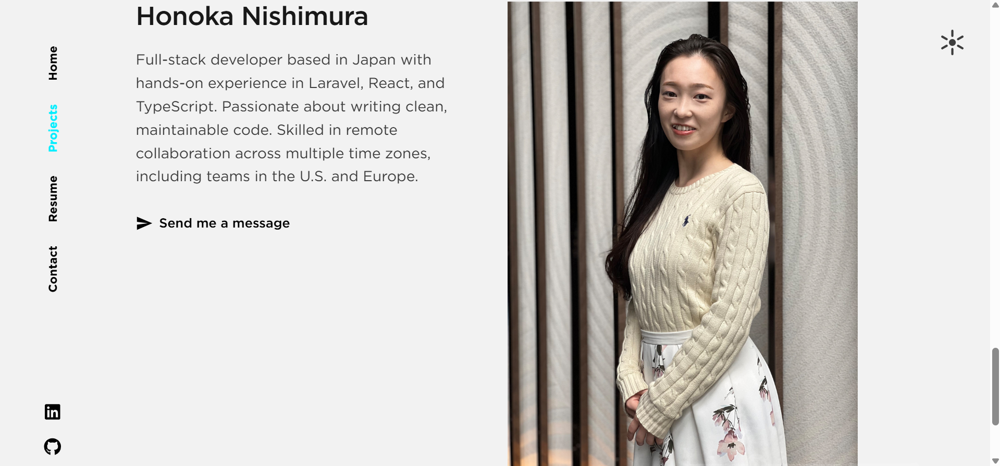

# Honoka Nishimura – Developer Portfolio

- This is my personal developer portfolio (https://honoka-dvt.pages.dev/), built with **React**, **TypeScript**, and **Tailwind CSS**, reflecting my passion for clean UI/UX and modern frontend architecture.
- The layout and animation were built from scratch using modern tools to ensure a high level of interactivity and responsiveness.

## About

- I'm a full-stack developer based in Japan with 1.5 years of experience in **PHP (Laravel)**, **React**, and **TypeScript**.  
- Open to fully remote roles with teams in the U.S., Europe, or other flexible time zones.


---

## Live Site

[https://honoka-dvt.pages.dev](https://honoka-dvt.pages.dev)

---
## Screenshots


### 🖥️ Top Page (Hero)


### 🛒 E-Commerce Project


### 🧩 SME Search Filter


### 🔧 No-Code ETL Tool


### 👩‍💻 About Me Section


## Featured Projects

### 1. Furniture E-Commerce UI
- Built with React + TypeScript + Tailwind CSS
- Features include: product filtering, responsive layout, localStorage-based cart, dark mode toggle
- Simulated client brief with modular, scalable structure

### 2. No-Code ETL Integration Platform
- Developed with Laravel and MySQL
- CSV upload, admin-only dashboard, dynamic member number assignment
- Real-world inspired member management system based on internal tools

### 3. Small Business Support Tool
- UI support and improvements for a Japanese SME-targeted SaaS platform
- Focused on improving information architecture and interface clarity


---

## Tech Stack Overview

| Layer         | Technology                                                  |
|---------------|--------------------------------------------------------------|
| Framework     | Remix (portfolio), Laravel 10 (projects)                     |
| Language      | TypeScript, PHP 8.x                                          |
| Styling       | Tailwind CSS, Bootstrap (project-dependent)                 |
| Animation     | Framer Motion, Intersection Observer                         |
| Backend       | Laravel (MySQL, SQLite + FTS5), Cloudflare D1                |
| Deployment    | Cloudflare Pages + Functions                                 |

---

## Getting Started

Install dependencies:

```bash
npm install

Run the development server:

npm run dev

Deploy to Cloudflare Pages:

npm run deploy
